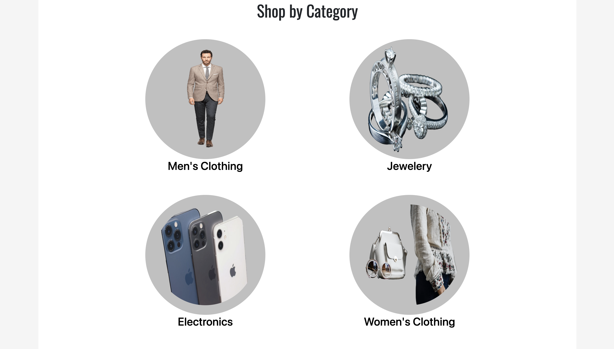

# ShopZone E-commerce Website

An integrated API website with login page that allow user to add and remove products from the cart.

# Api sources:

- https://fakestoreapi.com/products for products
- https://fakestoreapi.com/users for users

# About the website

The e-commerce ShopZone project includes the following pages:
(All pages include navbar and footer )

- Login Page
- Home Page
- About us Page
- Career page
- Products Page
- Detailed single product Page
- Contact Page
- Cart Page

# Features

The e-commerce ShopZone project includes the following features:

- Search bar to filter all products
- Add And remove products in the cart
- Calculate all chosen products price in cart
- Users who do not have account can be login as a guest

# Technologies Used

- React
- Redux
- Bootstrap
- Material UI
- CSS

# Screenshots

# Project Link

https://youssef-eissa.github.io/shopzone/
